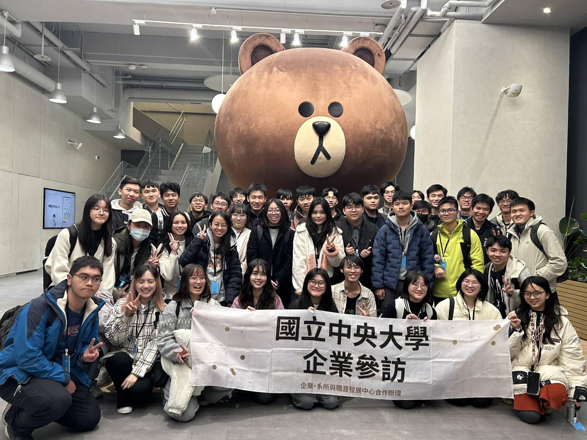
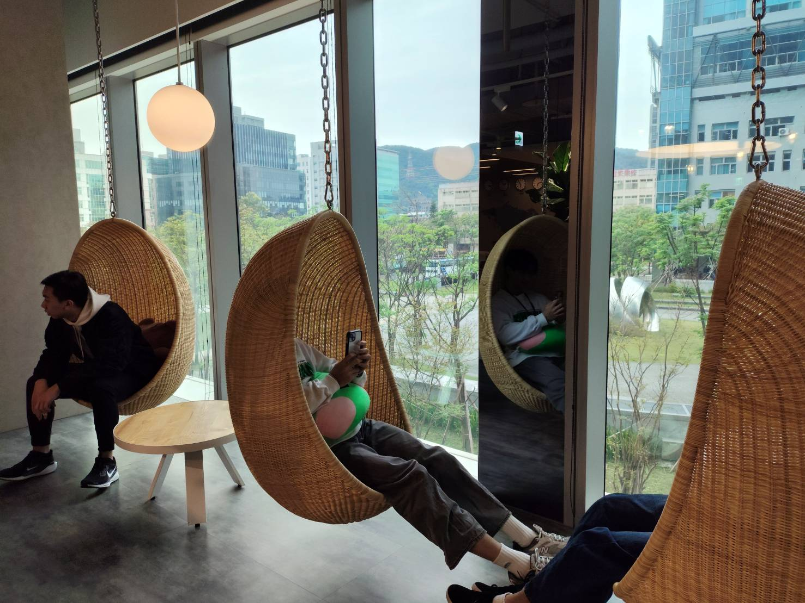
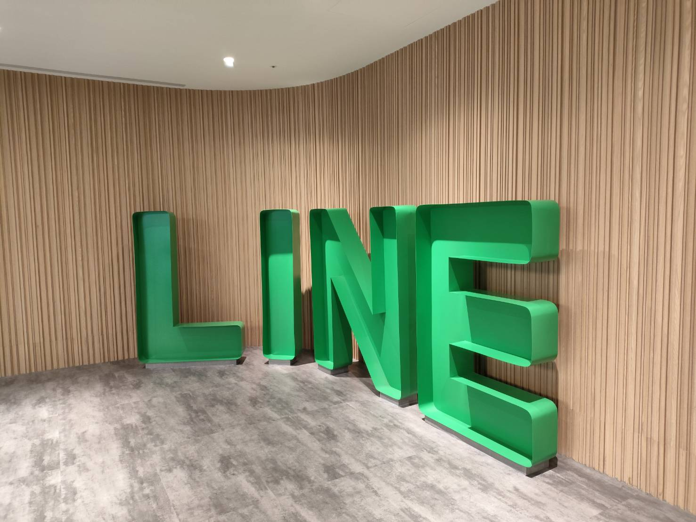
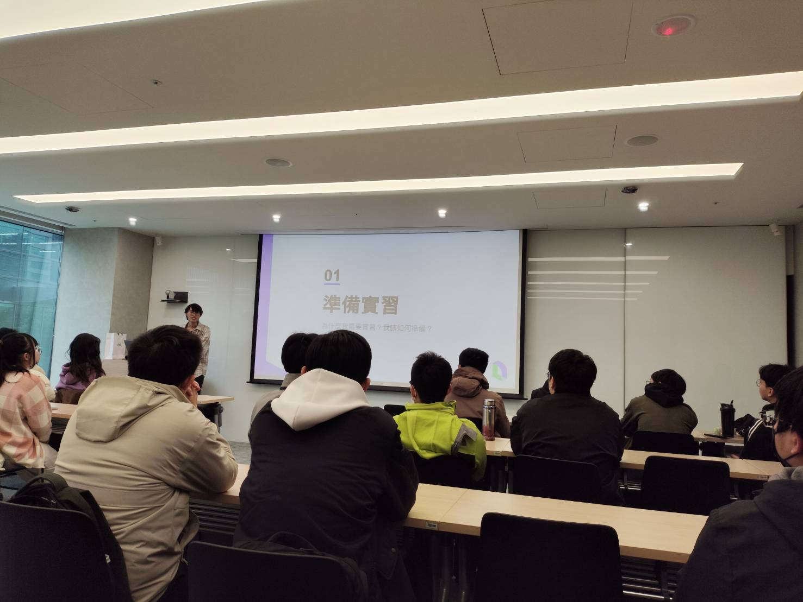

# 113學年_企業參訪_執行報告

> 負責人：張巧柔  
> 時間：2025/03/18 (二)  
> 地點：LINE Taiwan office  

## 活動目的與介紹

讓系上同學探索職涯方向、了解相關企業，以提前準備所需的技能以及軟硬實力

## 人員組織分配

- 張巧柔
  - 聯繫企業、決定日期時間
  - 職涯中心補助申請（聯繫社團指導教授及系所職涯導師簽名）
  - 系辦補助申請
  - 聯繫保險業務員
  - 聯繫遊覽車
  - 報名表單製作、發文調查人數
  - 官方郵件通知正備取同學、處理臨時取消之遞補(被保人更動)
  - 寄行前通知信
  - 提前準備簽到表與心得回饋表單
- 系學會大三幹部
  - 協助午餐發放

（有了學術部，你們應該可以分配一下工作內容，但這些都是環環相扣的，若每個人負責一小部分，分配下去的內容要定時回報，以免出包）

## 預算分配

\$30 ->代墊保險的郵局匯費
（如果你們代墊人有跨轉優惠可以不需要付這筆錢，我是用系學會帳戶逕付）  
\$7875+1240=9115（職涯中心全額補助） ->遊覽車車資、保費  
\$（系辦全額補助 ＆ 幫忙訂） ->午餐  

## 活動籌備

- 01/06-01/20 聯繫企業、決定日期時間
    - 時間大概是**寒假**就先決定好要去的企業和跟他們聯繫（上網找聯繫方式或如果你有認識的人可以請他協助問看看，也可參考之前**職涯中心/校園徵才團隊**有辦過的企業，系上跟學校去過的人也不多，據這次經驗來看，很多人不知道學校也提供這樣的參訪機會）
    - 系學會電子郵件「**113/企業參訪**」類別裡面有聯繫 LINE 的郵件範本（但我有先讓實習生問過一些基本資訊）
    - 這次40人是企業提供的人數上限，也是一臺遊覽車可負擔的人數，如果企業可以接受更多人，你們也可以出兩臺遊覽車
    - 時間盡量避開期中期末、必修課時間（這個很難全部避開，所以我才選沒有微積分會考的週二早上，自己斟酌）

- 01/22 職涯中心補助申請（聯繫社團指導教授及系所職涯導師簽名）
    - 申請表從職涯中心官網下載
    - 因是寒假期間，都以信件先聯繫確認申請表內容有無問題，開學後再繳紙本文件
    - 可一併詢問保險和遊覽車的聯繫窗口（我下面有提供今年職涯中心給的）
    - 社團指導教授：陳弘軒（可以跟系代確認有沒有變）
    - 系所職涯導師：韓伯維（可以跟職涯中心確定有沒有變）

- 02/10 系辦補助申請
    - 開學後直接找系辦姿如姊討論，早餐或午餐之類的補助

- 02/10 聯繫保險業務員
    - 職涯中心提供的保險員：國泰 劉宜華 
    - LINE ID：b9204117
    - 手機號碼：0955204342

- 02/18 聯繫遊覽車
    - 漢聲遊覽車官網可訂車
    - 它過一段時間才會回你
    - 前一天提供駕駛員資訊
    - 記得索取收據（職涯中心報帳用），沒有收據的話就問當初的聯繫人

- 02/17-02/24 報名表單製作、發文調查人數
    - 請參考之前的資料夾和發文
    - 其中保險的那些欄位，**先問過保險員需要哪些資料**

- 02/27-03/14 官方郵件通知正備取同學、處理臨時取消之遞補(被保人更動)
   - 跟保險人員確認最晚的更動日，如果那種臨時沒出現就算了（職涯中心還是會補助保費）
    - 要通知同學不克參加的話最晚什麼時候要講，也要強調**逾時不候**，跟企業約然後遲到的話就不好了，要估車程和考慮塞車問題
    - 好像可以寫程式寄信（但我太爛所以不會，問AI好像有機會）

- 03/17 寄行前通知信
    - 不要寄錯人就好
    - 可以用excel顏色標注最後會去是哪些人

## 活動執行流程

- 讓同學簽到
- 聯絡司機
- 遊覽車出發企業
- 企業參訪（以跟企業協調好的形式進行）
- 遊覽車回學校、給大家填心得回饋
- 發送午餐後解散

## 活動實際執行結果

## 傳承

### 活動交接與傳承要點

- **如果要找新聞部拍照**可以幫他們預留位置，但遊覽車和企業可負擔人數有限，要請他們提早告知來拍照的人數，或是就直接限制一到兩人，然後叫他們也要填表單（要辦保險），今年沒有溝通好，新聞部長沒填表單也沒有回報可以來拍照的人數，導致最後沒有空位讓他去
- 如果你們跟今年一樣辦在早上，可以考慮編預算**訂早餐**給大家吃（提前跟財務講），如果要在車上吃要跟司機確認，提醒同學不要弄髒車輛、垃圾記得帶走等
- 多的**午餐可以拿一份給司機大哥**，或提早跟系辦說要多訂一份給司機
- 我以為職涯中心會提供**簽到表**，但沒有，如果不想自己做，**系辦好像可以幫忙**
- 這次辦 LINE 的企業參訪，是因為我有去過，也知道他們很歡迎，所以聯繫上比較輕鬆，這邊提供交大資工系學會以前有辦過企業參訪的企業：ASUS、Gogolook、logitech、Appier、尊博科技、趨勢科技、Dcard、緯創軟體，當然你們也可以問看看有任何實習、正職的同學或學長姊在的公司有沒有企業參訪的機會，不過像是 Google 或 Microsoft ，我建議前者直接追蹤學校 GDG 社團（有企業參訪機會），後者他們有實習生統一辦的官方企業參訪（從「微軟未來生涯體驗計畫」的官網或粉專報名），但如果你們有內應也可以聯絡看看
- 上一屆的資料夾裡有**同學填的心得回饋**，可以參考看看，同學有提到想去參訪的公司除了Google 和 Microsoft，還有Meta、中華電信、Kkbox、intel、IBM
- 聯繫教授的部分可以用電子郵件聯絡，讓他們使用**電子簽**

### 給下一屆承辦人的話

學術部加油，這是一個細節滿多，然後補助管道也很多的活動，學校有資源請盡量用，我希望 115 年看得到企業參訪活動和分享會！（據系辦情報，比起業師演講，企業參訪更受大家喜愛，辦起來就對了）有問題就來問！
